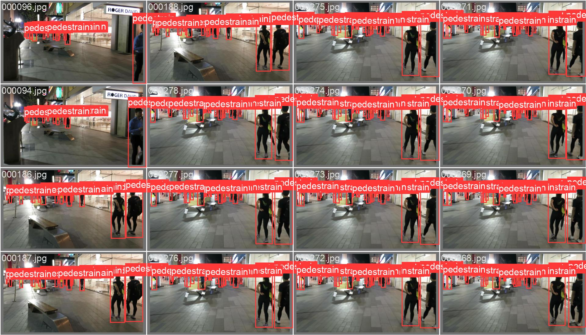
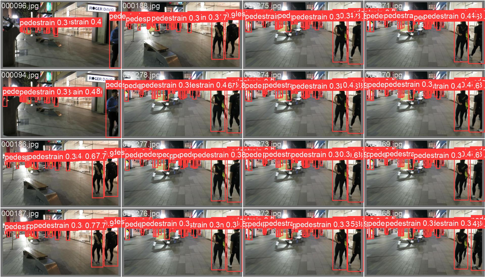
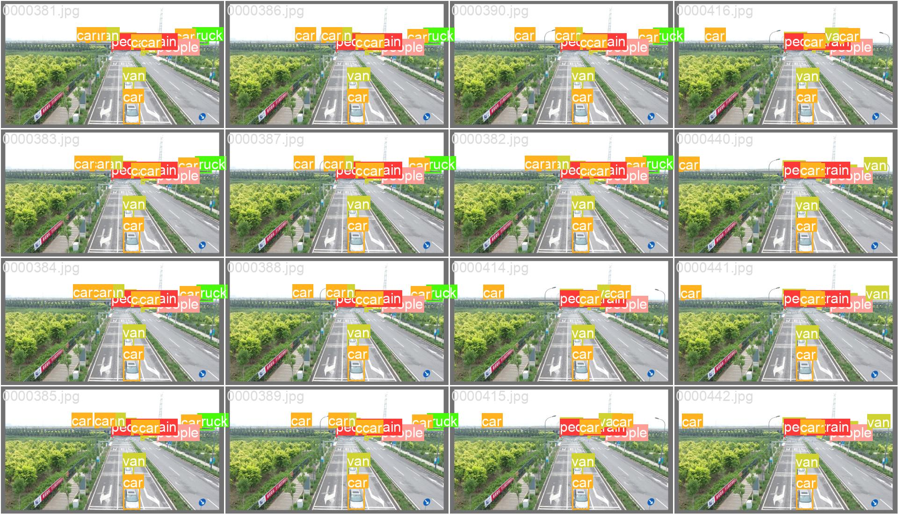
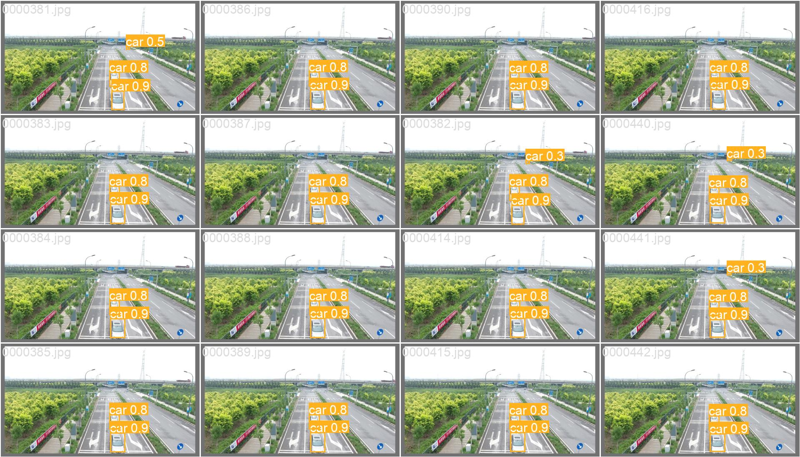
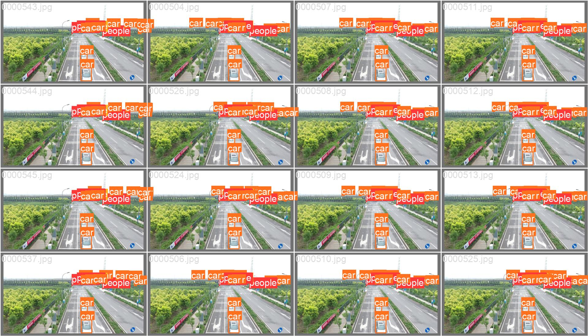
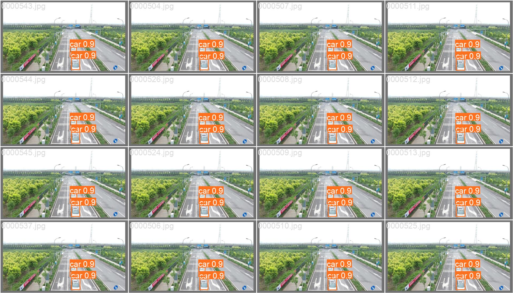

YBTrack是一种无人机目标跟踪的系统，算法采用YOLOv5+BYTE的组合，并在无人机视角下的数据集：Visdrone2019和MOT17数据集上进行了实验。本仓库包含所有训练的代码，跟踪代码、指标计算代码以及真机部署的代码。

### 跟踪效果视频

[YBTrack YOLOv5n Visdrone2019-relabel uav0000009_03358_v数据跟踪效果](https://www.bilibili.com/video/BV1WN4y1n7Q9/?vd_source=4f09fe81424e0b139fe8fc7d340052ff)

[YBTrack YOLOv5s Visdrone2019-relabel uav0000009_03358_v数据跟踪效果](https://www.bilibili.com/video/BV1fV411X7Ad/?vd_source=4f09fe81424e0b139fe8fc7d340052ff)

[YBTrack YOLOv5s Visdrone2019 uav0000009_03358_v数据跟踪效果](https://www.bilibili.com/video/BV1W94y1K7a1/?vd_source=4f09fe81424e0b139fe8fc7d340052ff)

[YBTrack YOLOv5s MOT17-04-DPM数据跟踪效果](https://www.bilibili.com/video/BV1mK4y1q7Lu/?vd_source=4f09fe81424e0b139fe8fc7d340052ff)

[YBTrack-YOLOv5s-MOT17-02-DPM数据跟踪效果](https://www.bilibili.com/video/BV17a4y1y7g6/?vd_source=4f09fe81424e0b139fe8fc7d340052ff)

[YBTrack-YOLOv5n-MOT17-04-DPM数据跟踪效果](https://www.bilibili.com/video/BV1Wc411s7NR/?vd_source=4f09fe81424e0b139fe8fc7d340052ff)

[YBTrack-YOLOv5n-MOT17-02-DPM数据跟踪效果](https://www.bilibili.com/video/BV1cT4y1h748/?vd_source=4f09fe81424e0b139fe8fc7d340052ff)


## 仓库文件说明

> `Data`  MOT17,Visdrone2019数据集的YOLO格式文件，训练YOLO的时候用，数据集的原始数据并没有放在这里，需要到官网上下载下来。

> `Easier_To_Use_TrackEval` 直接使用开源代码[Easier_To_Use_TrackEval](https://github.com/JackWoo0831/Easier_To_Use_TrackEval)对YBTrack目标跟踪算法计算跟踪指标

> `Paper_Figure_Generate_Code` 论文插图生成代码

> `UAV_Code` 无人机实机部署的代码，ROS结构

> `tracker_result` YBTrack算法在Visdrone2019和MOT17数据集上的跟踪结果输出，由yolov5_tracker里的代码输出
yolov5_tracker-根据[yolov7-tracker](https://github.com/JackWoo0831/Yolov7-tracker) 适配了yolov5的YBTrack，该代码中包含对Visdrone2019和MOT17数据集处理成YOLO格式的代码，对原仓库的代码有非常小的改动。


## 任务说明
该文件夹用来做目标跟踪的重新训练，之前在嵌入式板子上测试了使用yolov5做目标跟踪，之前的yolov5模型是从官网直接下载的采用coco数据集训练的，现在需要对yolov5模型重新训练，获取UAV在无人机视角下的目标检测性能。

## 训练数据包括：
MOT17 VisDrone2019 两个数据集都需要在官网下载并解压到电脑上，例如我的地址是：
```
/media/XXX/MOT17
/media/XXX/VisDrone2019
```
### MOT17实验
YOLO训练MOT17数据集实验步骤：
1. 利用工具把MOT17 数据集转化成yolo可以识别的格式，主要是转化标签文件
   格式转换过程
   ```
   python yolov5-tracker/tools/convert_MOT17_to_yolo.py --split train --generate_imgs
   python yolov5-tracker/tools/convert_MOT17_to_yolo.py --split val --generate_imgs
   python yolov5-tracker/tools/convert_MOT17_to_yolo.py --split test --generate_imgs
   ```
2. 加载yolo COCO预训练的模型
3. 训练MOT17的数据集
   当前的GPU设置30 batch-size， 64 batch-size 会爆炸, 大于32会莫名死机
   ```
   到github下载[yolov5](https://github.com/ultralytics/yolov5)的仓库
   cd yolov5
   python train.py --data ../Data/yaml/mot17.yaml --device 0 --epochs 200 --weights pts/yolov5s.pt --img 640 --batch-size 30
   ```
4. 在测试集中验证重新训练的结果，对比纯coco模型在测试集中的结果
   
   这里要做一些实验记录，包括：
   * 训练的损失曲线，各个指标的取值。
   * 对比在桌面端的性能和在嵌入式端的性能

5. 输出pytorch的pt模型
6. pt模型放到嵌入式板子上部署

> 训练结果如下所示，第一个图片是真实标签，第二个图片是模型输出

yolov5n_MOT17 标签图像

yolov5n_MOT17 预测结果



### Visdrone2019实验

YOLO训练Visdrone2019实验步骤：
1. 利用工具把VisDrone2019 数据集转化成yolo可以识别的格式，主要是转化标签文件
   格式转换过程
   ```
   python yolov5-tracker/tools/convert_VisDrone_to_yolov2.py --split VisDrone2019-MOT-train --generate_imgs
   python yolov5-tracker/tools/convert_VisDrone_to_yolov2.py --split VisDrone2019-MOT-val --generate_imgs
   python yolov5-tracker/tools/convert_VisDrone_to_yolov2.py --split VisDrone2019-MOT-test-dev --generate_imgs
   ```
2. 加载yolo COCO预训练的模型
3. 训练VisDrone的数据集
   当前的GPU只支持30 batch-size， 64 batch-size 会爆炸, 32会莫名死机
   ```
   到github下载[yolov5](https://github.com/ultralytics/yolov5)的仓库
   cd yolov5
   python train.py --data ../Data/yaml/visdrone_all.yaml --device 0 --epochs 200 --weights pts/yolov5s.pt --img 640 --batch-size 30
   ```
4. 在测试集中验证重新训练的结果，对比纯coco模型在测试集中的结果
     这里要做一些实验记录，包括：
   * 训练的损失曲线，各个指标的取值
   * 对比在桌面端的性能和在嵌入式端的性能

5. 输出pytorch的pt模型
6. pt模型放到嵌入式板子上部署


> 训练结果如下所示，第一个图片是真实标签，第二个图片是模型输出

yolov5n visdrone2019 标签

yolov5n visdrone2019 预测结果


从上图的结果中可以看出，很多小目标都无法被检测出来。


### Visdrone2019 relabel实验
Visdrone2019 relabel 是根据上一个实验的结果重新调整了Visdrone2019的标签，融合了部分特征差异不明显的标签，目的是为了提升YBTrack的跟踪性能。

YOLO训练Visdrone2019实验步骤：
1. 利用工具把VisDrone2019 数据集转化成yolo可以识别的格式，主要是转化标签文件
   格式转换过程
   ```
   python yolov5-tracker/tools/convert_VisDrone_to_yolov2.py --split VisDrone2019-MOT-train --generate_imgs
   python yolov5-tracker/tools/convert_VisDrone_to_yolov2.py --split VisDrone2019-MOT-val --generate_imgs
   python yolov5-tracker/tools/convert_VisDrone_to_yolov2.py --split VisDrone2019-MOT-test-dev --generate_imgs
   ```
2. 加载yolo COCO预训练的模型
3. 训练VisDrone的数据集
   当前的GPU只支持30 batch-size， 64 batch-size 会爆炸, 32会莫名死机
   ```
   到github下载[yolov5](https://github.com/ultralytics/yolov5)的仓库
   cd yolov5
   python train.py --data ../Data/yaml/visdrone_relabel.yaml --device 0 --epochs 200 --weights pts/yolov5s.pt --img 640 --batch-size 30
   ```
4. 在测试集中验证重新训练的结果，对比纯coco模型在测试集中的结果
     这里要做一些实验记录，包括：
   * 训练的损失曲线，各个指标的取值
   * 对比在桌面端的性能和在嵌入式端的性能

5. 输出pytorch的pt模型
6. pt模型放到嵌入式板子上部署


> 训练结果如下所示，第一个图片是真实标签，第二个图片是模型输出

yolov5n visdrone2019 重新调整标签数据集的原始标签

yolov5n visdrone2019 重新调整标签数据集的预测结果



## 目标跟踪实验

首先，要根据自己的模型选择自己使用的是yolov5/yolov7/yolov8的模型，yolov7-tracker仓库默认使用的是yolov7的模型，
如果我们用yolov5的模型，需要把该仓库的tracker文件夹复制到yolov5的仓库目录下，然后才能执行跟踪。

> 测试`visdrone2019`数据集性能

> 进入到`yolov5-tracker`目录下

> 要测试`VisDrone2019`数据集，需要指定以下参数

`--dataset visdrone` 参数是数据集所在位置
`--data_format origin` 我们已经将VisDrone2019转化为`yolo`格式了，因此，我们采用`--data_format yolo`
`--tracker bytetrack` 指定使用的跟踪模型
`--model_path` 指定模型，我们用的是yolov5源仓库默认使用yolov7

`--dataset_dir` 是本文新增的参数，为了程序能够读取到其他目录下的数据
> 修改tracker/config_files/visdrone.yaml 文件里的配置
要采用tracker/track_yolov5.py 因为我们训练的是yolov5
```
cd tracker
python tracker/track_yolov5.py --dataset_dir /home/XXX/yolo_tracker_exp/Data/ --dataset visdrone --data_format yolo --tracker bytetrack --model_path /home/XXX/yolo_tracker_exp/yolov5/runs/train/yolov5s_visdrone2019_epoch200/weights/best.pt --save_videos
```


### MOT17 half 数据集验证
由于MOT17数据集的test没有GT，所以要验证MOT17的跟踪性能，我们需要将train的部分数据分出来作为测试，我们把
```
MOT17-02-DPM
MOT17-04-DPM
```

> 运行代码
```
python tracker/track_yolov5.py --dataset_dir /home/XXX/yolo_tracker_exp/Data/ --dataset mot17_half --data_format yolo --tracker bytetrack --model_path /home/XXX/yolo_tracker_exp/yolov5/runs/train/yolov5s_mot17_epoch200/weights/best.pt --save_videos
```
三个数据分出来放到test里做tracker的验证。

### Visdrone2019 重新调整标签后的结果

> 运行代码

```
python tracker/track_yolov5.py --dataset_dir /home/XXX/yolo_tracker_exp/Data/ --dataset visdrone_relabel --data_format yolo --tracker bytetrack --model_path /home/XXX/yolo_tracker_exp/yolov5/runs/train/yolov5n_visdrone2019_relabel_epoch200/weights/best.pt --save_videos
```

## 实机部署说明

实机部署代码参考`UAV_Code`，采用ROS通讯，Melodic版本，运行此代码需要部署到TX2机载计算机上，首先将之前训练好的pt文件转成TensorRT的文件格式`eigine`格式，转换的过程借鉴了[tensorrtx](https://github.com/wang-xinyu/tensorrtx)，同时对比实验采用了OpenCV-DNN部署了YOLO，需要将`pt`模型转换成`onnx`格式文件给Opencv-DNN模块。

`OpenCV-DNN`模块是`OpenCV`的模块，在安装的时候务必要选择安装`DNN`功能。`OpenCV`版本需要大于`4.5`才支持`pytorch`模型的转换。在我们的环境里，安装的是`OpenCV4.6`， 采用源码安装方式，且把`ROS`的`cv_bridge`替换成了依赖于`OpenCV4.X`版本的软件，复现代码时，`OpenCV`、`cv_bridge`这里可能会有版本兼容问题。

> 如果你想在PC上运行实机代码，请注意

1. 实机不支持TensorRT版本软件，那一套软件依赖于Nvidia的Jetson系列的API
2. 可以运行OpenCV-DNN版本的软件，但要重新安装OpenCV4.6在你自己的PC上，然后还需要更改一些配置。可以在实机代码里搜索`OpenCV 4.6`，就能找到CmakeList.txt配置的地方。
3. PC上无法跑云台控制的功能，需要把代码拆解一下，只跑YBTrack算法部分


## 参考了大量前人的工作

1. https://github.com/ultralytics/yolov5

2. https://github.com/JackWoo0831/Yolov7-tracker

3. https://github.com/JackWoo0831/Easier_To_Use_TrackEval

4. https://github.com/amov-lab/Prometheus

5. https://github.com/shaoshengsong/DeepSORT